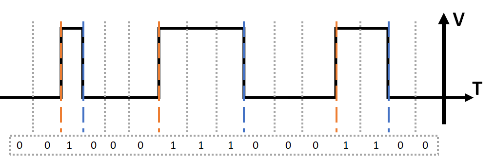
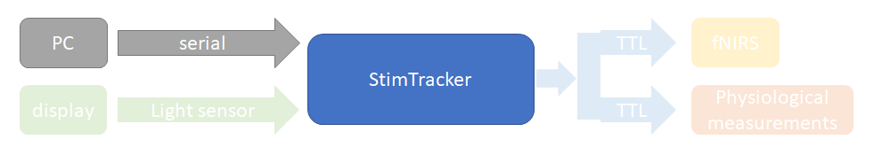

# multimodal-psych

# DRAFT; still in writing

Fundamentals of system design in multimodal physiological measurements.

Mar. 15, 2023 Simon Kuwahara

---

Please cite the conference presentation:

<pre>
Kiyomitsu Niioka, Mayuko Mikami, Simon H. Kuwahara, Wakana Kawai, Ippeita Dan. (2022, October 9-12). Relationship between autonomic responses and cortical activation pattern during the concealed information test[Conference presentation]. SfNIRS 2022 Boston, MA, United States.
</pre>

---

## Contents

<pre>
multimodal-psych
│
├── Cedrus_StimTracker_utils
│   └── ReadmeStimTracker.m: Demonstration code for beginners.
│
├── Niioka_etal_2023
│   ├── CIT_FINAL_V2.m:   Raw experiment code for the CIT paper.
│   └── DateRandom4CIT.m: Function used in CIT_FINAL_V2.m.
│
├── img/* : Images for README.md
└── README.md
</pre>

## Guide for multimodal physiological measurements

In this README, we will focus on replicating or designing a new multimodal psychological measurement setup.
We will first discuss general ideas of multimodal physiological measurements.
Then, we will dive deeper into the details of how we combined fNIRS(ETG-4000) and psychophysiological measurement device(Polymate V AP5148).

## Prerequisite Knowledge

There are some good-to-knows before you start a multimodal measurement project.

- Basics of computer science.
  - Basic computer architechture.
  - Basic software engineering.
  - Basic programming.
  - Basic networking.
  - Basic Linux.
  - How a computer monitor works(scanlines, interlacing, etc.).
    - CRT
    - Plasma
    - LCD(TN/VA/IPS)
    - OLED
  - Common computer bus types(physical connectors and communication protocols). <br> For example...
    - USB
    - Display Port
    - HDMI
    - VGA
    - DVI
    - RS-232C(serial port)
    - IEEE 1284(parallel port)
    - D-Subminiature
    - RJ-45
    - PCI-express

- Very, very basic knowledge of electronics.
  - Ohm's law.
  - Basic knowledge like GND, co-ax cables, AC/DC, battery types, power connectors, etc.
  - How to use a multimeter.
  - How to use a soldering iron.

- Basics of data acquisition(DAQ).
  - NI has a great video. Check it out.
  [https://www.ni.com/en-us/shop/data-acquisition/sensor-fundamentals--data-acquisition-basics-and-terminology.html](https://www.ni.com/en-us/shop/data-acquisition/sensor-fundamentals--data-acquisition-basics-and-terminology.html)

If you're familiar with these topics, great!
You'll probably already know most of the things I'll be talking about.

But for anyone who's not a tech-savvy nerd, take your time googling every single word you don't understand while you read along.
The whole idea of multimodal measurement is very simple, but you will have a hard time if you lack the fundamental knowledge.

Playing around with a single-board computer like a Raspberry Pi or an Arduino is highly recommended.
Don't be afraid to spend a bit of money and some time playing around with these. It'll be worth it.
These share many key concepts with multimodal psychological experiment setups and you can even use them to create custom DIY solutions.

## Basic Hardware Setup in Psychological Experiments

Most of the psychological experiments are based on the Stimulus-Organism-Response(S-O-R) model.


The physical setups can be divided into three parts; "Stimulus", "Organism" and "Response".
Since "Organism" will be our participant, our setup would consist of the "Stimulus" component and the "Response" component.


The "Stimulus" component would be our computer running stimulus presentation software, for example, Psychtoolbox3, PsychoPy or E-Prime3.

The "Response" component would be any measurement system, for example, fNIRS, EEG, and eye trackers.

If these stimulus-presentation and measurement systems operate independently, we need time synchronization between all systems to obtain temporal measures, for example, reaction time.


There are multiple ways to achieve synchronization between computers. In psychological measurements, it will be convenient to set the "Stimulus" component as the "master clock".
We usually send synchronization signals from the "Stimulus" component to the "Response" component.


In the recorded data in each measurement system, there would likely be a column that records the sync signal.
We would compare the sync signals from all measurement systems and find corresponding rows in the sync signal column, then we could concatenate the data using the sync signal as the key.


When designing a measurement setup, we must consider the degree of system integration capability for each measurement system/device.
Generally speaking, we can categorize them into three levels. Note that this is just a general overview and details could vary.

| level of connectivity | description |
|---|---|
| level 1: <br> no communication | Systems that have no i/o that can connect to the stimulus presentation computer. These are usually designed to be used as a standalone device. The measured values are often designed to be read visually. These are pretty much useless and you will not see them in devices that specialize in psychological measurement. <br> **example: regular mercury/alcohol thermometer** |
| level 2: <br> one-way communication | Systems that equip standard i/o ports (which are capable of two-way communication but) used only for receiving synchronization signals. These will be the most common type you will see and will often have a connector for TTL or RS-232C. We will discuss these protocols in the next chapter. <br> **example: fNIRS and majority of psychophysiological measurement systems** |
| level 3: <br> two-way communication | Systems that are highly integrated and could "talk" with the stimulus presentation computer. These are capable to expand beyond the S-O-R model. These can give the stimulus presentation computer instant direct feedback and quickly change the stimulus according to the parrticipant's response. <br> **example: keyboard/mouse input and majority of eye trackers** |


## Common Protocols for Synchronization Signals

We will focus our discussion on combining measurement systems in level 2 mentioned above; "Stimulus" to "Response" one-way sync signal connection.
For the old folks, this is all common knowledge, but it seems that's not the case for the younger crowd.
This is understandable because any information about synchronization is poorly documented and even if you find any, it won't be in the psychology field in the first place.

There are two common protocols used for sync signals in physiological measurements.

- TTL
- RS-232C

Here is a comparison of these two protocols.

|| TTL | RS-232C |
|---|---|---|
| related standards | IEEE 1284 | EIA/TIA-232 |
| tx voltage mark | 2.4 ~ 5V | 5 ~ 15V |
| tx voltage space | 0 ~ 0.4V | -5 ~ -15V |
| rx voltage mark | 2 ~ 5V | 3 ~ 15V |
| rx voltage space | 0 ~ 0.8V | -3 ~ -15V |
| common connectors | DB25, BNC, RJ45 | DB9, RJ45, DB15, DB25, USB |
| voltage domain | digital | digital |
| time domain | analog | digital |
| latency | low | high |
| signal | binary(ON or OFF) | ASCII character |

> tx: transmit, rx: receive

### TTL

TTL is the most simple form of communication; just connect a line and apply a voltage. The line is considered high(1) when there's a voltage applied, and considered low(0) when 0V.

The term "high" and "low" have synonyms.
They all mean the same; the binary states of a line.

| TTL-high | TTL-low |
|:-:|:-:|
| 1 | 0 |
| hi | lo |
| mark | space |
| on | off |
| pull up | pull down |

> Fun fact: mark/space comes from the punched tape era.


Most devices are either 3.3V or 5V.
The voltage usually doesn't matter as long as we're operating within the standard voltage range, but we have seen cases where the receiving end prefers 5V for some unknown reason.
**Always check the manufacturer's documentation.**
TTL is so simple that DIY solutions can be easily implemented.
If going DIY, remember to be **conservative in what you send and liberal in what you accept**.

TTL can only send a binary signal per line(1bit/ch), so we usually use multiple lines.
The maximum number of lines depends on the specific system but it is often 8 channels, which corresponds to a parallel port.
> $8\ bits\ =\ 1\ byte$


TTL could be sent via IEEE-1284 parallel port.
Many modern computers lack not only the physical DB25 connector but even the motherboard header pins too.
PCI-e adapters are available if that's the case.
Unfortunately, the parallel port is a legacy protocol you might encounter some trial and error when you're trying to control it.
Specialized USB to TTL adapters are easier to use and are becoming more and more common.

>The PTB GitHub Wiki has great information.
>[https://github.com/Psychtoolbox-3/Psychtoolbox-3/wiki/FAQ#ttl-triggers](https://github.com/Psychtoolbox-3/Psychtoolbox-3/wiki/FAQ#ttl-triggers)


If you're presenting visual stimuli, it is better to send the TTL signal directly from the computer monitor rather than the stimulus presentation computer.
This is because computer monitors can't present visual stimuli instantly and will always have some "lag".


We can use a photodiode connected to a DC power supply or devices with light sensor input such as the Cedrus StimTracker.
By attaching the light sensor directly to the computer monitor and controlling the color of the display output underneath the light sensor using the stimulus presentation software, we can send TTL sync signals.


By presenting the visual stimuli and changing the color underneath the light sensor simultaneously, we can send TTL sync signals at the exact moment when the visual stimulus gets presented.
Due to how computer monitors work, it is ideal to place the light sensor at the same height as the visual stimulus.


The lower the refresh rate, the placement of the light sensor will have a larger effect on temporal accuracy.
If the refresh rate = 60Hz, it will take approximately 16.7ms to scan from the top-left to the bottom-right pixel.

| refresh rate | milliseconds per frame |
|:-:|:-:|
| 60 Hz | 16.66... ms |
| 120 Hz | 8.333... ms |
| 144 Hz | 6.944... ms |
| 240 Hz | 4.166... ms |
| 360 Hz | 2.777... ms |

> If you're not familiar with how computer monitors work and this doesn't make much sense, check out this awesome video by The Slo Mo Guys.
> [https://youtu.be/3BJU2drrtCM](https://youtu.be/3BJU2drrtCM)

If timing is critical, measuring the latency is highly recommended. We can directly measure latency using a DAQ device as shown below.
By simultaneously presenting a visual stimulus and sending a TTL signal, we can measure the time difference between the two TTL signals(8 and 9 in the image below).

1. stimulus presentation computer
2. stimulus presentation display
3. Cedrus StimTracker or equivalent device
4. DAQ device(preferred) or raspberry pi
5. recording computer controlling DAQ device
6. display cable
7. light sensor
8. TTL from light sensor(StimTracker)
9. TTL from stimulus presentation software(Parallel port)


### RS-232C

RS-232C is still commonly used in a wide variety of industries today, and is often referred to as "serial communication".
If you're already using RS-232C to configure devices such as routers, you're already a pro at this. There's nothing more to learn here.
We will only focus on the very basics for the unacquainted for now.
If you're interested, you can find information fairly easily with just a quick Google search.

> Ben Eater has a great video explaining RS-232C.
> [https://youtu.be/AHYNxpqKqwo](https://youtu.be/AHYNxpqKqwo)

RS-232C is the most simple form of serial communication.
When using TTL we could only send 1bit of data per channel at a given point in time.
If we set a cycling frequency(Baud rate), we can send a burst of bits at once on a single line.



If we pre-define the meaning for the sequence of 1s and 0s, i.e. like ASCII, we can send meaningful information such as characters only using a single line.


Most programming languages have functions for RS-232C.
Though the physical DB9 connectors are less common on modern computers, even modern motherboards are likely to equip RS-232C header pins.
Also, USB or PCI-e adapters for serial ports are widely available.
In general, RS-232C will probably just work out of the box.


Since RS-232C requires time duration and more processing than TTL, there will always be a larger delay compared to TTL.
Use RS-232C when time accuracy is not critical or use it in conjunction with TTL.
Time accuracy will improve if you code in C++ and wrap it in Matlab, Python, etc.

### Blessing from the gaming industry

The rise of the gaming industry has changed the landscape of psychological experiment hardware.

LCD displays used to have noticeable latency, but modern gaming displays have become extremely fast(both in latency and refresh rate).
In addition, most have decent color accuracy which makes them extremely versatile.
As of Mar.2023, the fastest available monitors have a refresh rate of 500Hz and a GTG(gray-to-gray)response time of 0.5ms.
(We do NOT recommend bleeding-edge technology unless you really need it.)

> LTT coverage of the AW2524H.
> [https://youtu.be/Ewo8tt6bgZU](https://youtu.be/Ewo8tt6bgZU)

On the other hand, OLED has drastically improved in recent years.
OLED might become mainstream in psychological experiments in the very near future. Its low latency makes it extremely advantageous in psychological applications.

Keep in mind that display technology is rapidly evolving and any information we have now may become irrelevant very quickly.
**Know your equipment and requirements!**

Behavioral responses could also be measured using TTL.
By connecting a 3.3V or 5V power source and a switch, we can send TTL when the participant presses the switch.
This is the same idea as connecting a switch to a GPIO pin on a raspberry pi.
(Note that you will need to consider switch/contact bounce unless you are using an optical switch.)

This was one of the ways to deal with the horrible time accuracy of conventional keyboards, but thanks to the gaming industry, our lives became much easier.
Modern high-end gaming keyboards with high poling rates have the same or even better time accuracy compared to specialized behavioral response measurement devices.

## The Setup in the Paper

Below is a list of the main components of this experiment configuration.

| | |
|---|---|
| stimulus presentation | Psychtoolbox 3 on Win10 (i7-10510U 24G) |
| display | Dell S2319HS (1920*1080 60Hz GTG5ms) |
| sync signal control | Cedrus StimTracker Quad gen2 |
| fNIRS | Hitachi ETG-4000 |
| physiological measurements | Miyuki Polymate V AP5148 |

> Disclaimer:
> **You should NOT be running PTB on Windows!**
> **Use Linux!**


The sync signal was controlled by the StimTracker.
We combined TTL and RS-232C from the Stimulus side.

TTL from the light sensor was passed through StimTracker as TTL.
RS-232C from the stimulus presentation computer was converted to TTL by StimTracker.
TTL was split into two identical signals and fed to the two measurement systems, ETG-4000 and Polymate.


### Stimulus presentation computer to StimTracker

The stimulus presentation computer and StimTracker were connected with serial over USB.

Cedrus XID commands were sent via serial.
The StimTracker will convert the XID commands to TTL signals.
The TTL duration for each XID command call was set to 1 sec.
Details are explained in ```/Cedrus_StimTracker_utils/readme_StimTracker.m```.
The raw source code is ```/Niioka_etal_2023/CIT_FINAL_V2.m```.

| sent information | source | TTL ch. |
|---|:---:|:---:|
| Start of experiment | USB0 | ch.1 |
| End of experiment | USB1 | ch.2 |



### Display to StimTracker

A light sensor was attached to the top-left of the display and sent TTL signals whenever the screen underneath the light sensor was lit white.
The light sensor was attached to the top-left because it was important to have fewer visual distractions rather than exact time accuracy in this experiment.
From the officially stated specs of the monitor, the delay is estimated to be about 13~15ms.

In PTB, We used the ```Screen('gluDisk',...)``` function and adjusted the position and diameter so that either a black or a white circle will be rendered underneath the light sensor for all of the frames.
Details are explained in ```/Cedrus_StimTracker_utils/readme_StimTracker.m```.
The raw source code is ```/Niioka_etal_2023/CIT_FINAL_V2.m```.

| sent information | source | TTL ch. |
|---|:---:|:---:|
| stimulus onset | light sensor 1 | ch.8 |


### StimTracker to measurement systems

TTL is sent from the DIN connector on the rear of the StimTracker.
The pin-out can be found on Cedrus's official support page.
[https://cedrus.com/support/stimtracker/tn1960_quad_ttl_output.htm](https://cedrus.com/support/stimtracker/tn1960_quad_ttl_output.htm)

We made a custom DIN connector to D-sub 9-pin connector adapter.

The standard pin-out of the DIN connector is shown below. Note that pin 6 is above pin 5 and pin 8 is under pin 9.


> source: [https://www.ni.com/ja-jp/support/documentation/supplemental/18/pinout-of-the-9-pin-din-cable-for-the-ni-dmm-and-ni-high-speed-d.html](https://www.ni.com/ja-jp/support/documentation/supplemental/18/pinout-of-the-9-pin-din-cable-for-the-ni-dmm-and-ni-high-speed-d.html)


The standard pin-out of the DB9 connector is shown below.


> source: [http://www.clarkwire.com/PinOutRSDB9.htm](http://www.clarkwire.com/PinOutRSDB9.htm)

Then, we repurposed a DB9 to BNC*8 adapter box.

We used BNC splitters to split the signal to 2 outputs; ETG-4000 and Polymate.

ETG-4000 has BNC connectors where we can directly connect co-ax cables.
For Polymate, we connected the co-ax cables to the BNC connectors 1-3 on the AP-U161; a proprietary DAC(Digital Analog Converter).

> It is interesting that Polymate inputs the sync signal as an analog signal given that its main purpose is to collect various analog sensor inputs.

For details, consult the official manuals for ETG-4000, Polymate V AP5148 and AP-U161.

| information | source | DIN ch | BNC ch | fNIRS ch | polymate ch |
|---|---|:---:|:---:|:---:|:---:|
| Start experiment | USB 0          | 1 | 1 | 1 | 1 |
| End experiment   | USB 1          | 2 | 2 | 2 | 2 |
| stimulus onset   | light sensor 1 | 8 | 8 | 3 | 3 |


